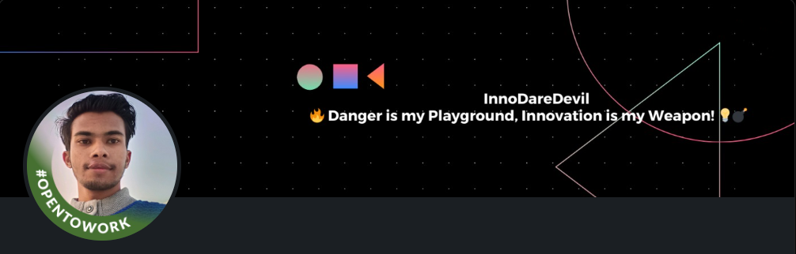

 

 

  

<h1 align="center"><b>Hi , I'm Aditya Kalambe</b></h1>

 
  +I'm+InnoDareDevil,;Danger+is+my+Playground,;Innovation+is+my+Weapon!,;A+passionate+Full-Stack+Developer,;Done+3+internships,;Computer+Science+and+Engineering+Student,;Active+Learner,;Love+to+learn+new+stuffs..</>">

 

## <picture></picture> **About me**

<picture> </picture>

 

- 💻 A passionate Full-Stack developer.
- 🎒 I'm a 2023 graduate
- 💻 My major was in Information Technology.
- 🔥 I develop websites.
- 👀 I’m currently open for an Intern or a new job opportunity, this is [my resume](https://drive.google.com/file/d/1yEKV5RS9KTauoIRoMXyE81GxF85eAeRm/view?usp=sharing)

  

  

## <b> Skills</b>
 
<h3>Programming Languages</h3>

<td>
    &nbsp;&nbsp;&nbsp;&nbsp;
</td>
<td>
    &nbsp;&nbsp;&nbsp;&nbsp;
</td>
<td>
    &nbsp;&nbsp;&nbsp;&nbsp;
</td>
<td>
    <a>
        &nbsp;
    </a>&nbsp;&nbsp;&nbsp;&nbsp;
</td>
<td>
    <a>
        &nbsp;
    </a>&nbsp;&nbsp;&nbsp;&nbsp;
</td>

 
<h3>Front-End Technologies</h3>

    <td>
        
        &nbsp;&nbsp;&nbsp;&nbsp;
    </td>
    <td>
        
        &nbsp;&nbsp;&nbsp;&nbsp;
    </td>
    <td>
        
        &nbsp;&nbsp;&nbsp;&nbsp;
    </td>
    <td>
        
        &nbsp;&nbsp;&nbsp;&nbsp;
    </td>
    <td>
        
        &nbsp;&nbsp;&nbsp;&nbsp;
    </td>

 
<h3>Java Technologies</h3>

        <td>&nbsp;&nbsp;&nbsp;&nbsp;</td>
        <td>&nbsp;&nbsp;&nbsp;&nbsp;</td>
        <td>&nbsp;&nbsp;&nbsp;&nbsp;</td>
        <td>&nbsp;&nbsp;&nbsp;&nbsp;</td>
        <td>&nbsp;&nbsp;&nbsp;&nbsp;</td>
        <td>&nbsp;&nbsp;&nbsp;&nbsp;</td>

 
<h3>Design</h3>

                                                                                                                                 
        <td>&nbsp;&nbsp;&nbsp;&nbsp;</td>

     

 
<h3>Databases</h3>

                                                                                                                                                   
        <td>&nbsp;&nbsp;&nbsp;&nbsp;</td>
        <td>&nbsp;&nbsp;&nbsp;&nbsp;</td>        
        <td>&nbsp;&nbsp;&nbsp;&nbsp;</td>

 
<h3>Cloud Hosting</h3>

        <td>&nbsp;&nbsp;&nbsp;&nbsp;</td>               
        <td>&nbsp;&nbsp;&nbsp;&nbsp;</td>
        <td>&nbsp;&nbsp;&nbsp;&nbsp;</td>
        <td>&nbsp;&nbsp;&nbsp;&nbsp;</td>
        <td>&nbsp;&nbsp;&nbsp;&nbsp;</td>

    
 
<h3>Softwares and Tools</h3>

<td>
      
      &nbsp;&nbsp;&nbsp;&nbsp;
    </td>
    <td>
      
      &nbsp;&nbsp;&nbsp;&nbsp;
    </td>
    <td>
      
      &nbsp;&nbsp;&nbsp;&nbsp;
    </td>
    <td>
      
      &nbsp;&nbsp;&nbsp;&nbsp;
    </td>
    <td>
      
      &nbsp;&nbsp;&nbsp;&nbsp;
    </td>

<td>
      
      &nbsp;&nbsp;&nbsp;&nbsp;
    </td>
    <td>
      
      &nbsp;&nbsp;&nbsp;&nbsp;
    </td>
    <td>
      
      &nbsp;&nbsp;&nbsp;&nbsp;
    </td>
    <td>
      
      &nbsp;&nbsp;&nbsp;&nbsp;
    </td>
    <td>
      
      &nbsp;&nbsp;&nbsp;&nbsp;
    </td>

    <td>
      
      &nbsp;&nbsp;&nbsp;&nbsp;
    </td>
    <td>
      
      &nbsp;&nbsp;&nbsp;&nbsp;
    </td>
    <td>
      
      &nbsp;&nbsp;&nbsp;&nbsp;
    </td>
    <td>
      
      &nbsp;&nbsp;&nbsp;&nbsp;
    </td>
    <td>
      <a href="" target="_blank">
        &nbsp;
      </a>
      &nbsp;&nbsp;&nbsp;&nbsp;
    </td>

 
<h3>Operating System :</h3>

  <td>
    
    &nbsp;&nbsp;&nbsp;&nbsp;
  </td>

   <td>
    
    &nbsp;&nbsp;&nbsp;&nbsp;
  </td>

   <td>
    
    &nbsp;&nbsp;&nbsp;&nbsp;
  </td>

   <td>
    
    &nbsp;&nbsp;&nbsp;&nbsp;
  </td>

   <td>
    
    &nbsp;&nbsp;&nbsp;&nbsp;
   </td>

 

-----

# 📊 GitHub Stats:

###

   

  
   

  
  
   
  

###

## 🏆 GitHub Trophies

  

-----

 
<h3><b> Let's Connect..!</b></h3>

  <td>
    
    &nbsp;&nbsp;&nbsp;&nbsp;
  </td>

  <td>
    
    &nbsp;&nbsp;&nbsp;&nbsp;
  </td>

  <td>
    
    &nbsp;&nbsp;&nbsp;&nbsp;
  </td>

  <td>
    
    &nbsp;&nbsp;&nbsp;&nbsp;
  </td>

  <td>
    
    &nbsp;&nbsp;&nbsp;&nbsp;
  </td>

 

 
  

    <h3>😂 Dev Meme </h3>
    

   

 

